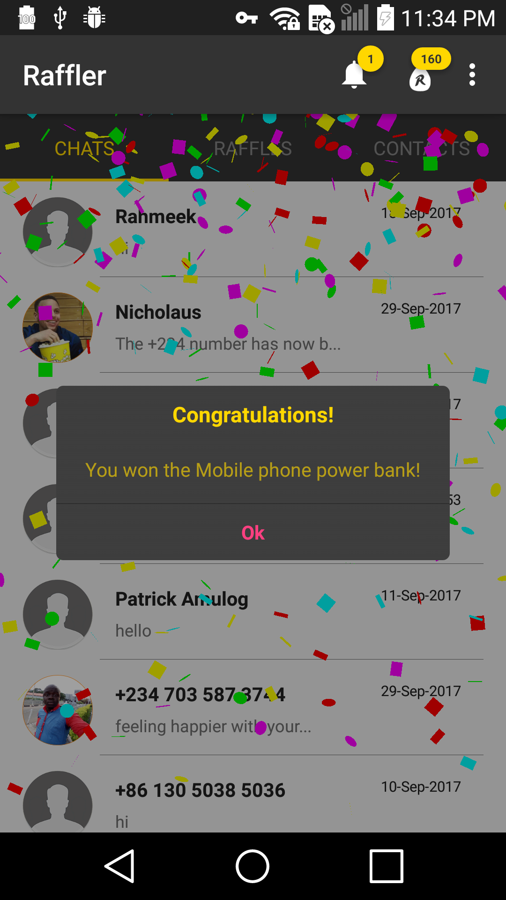
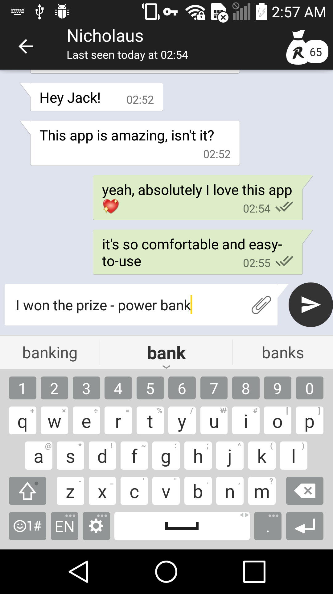
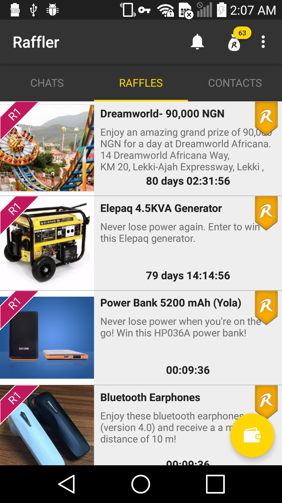
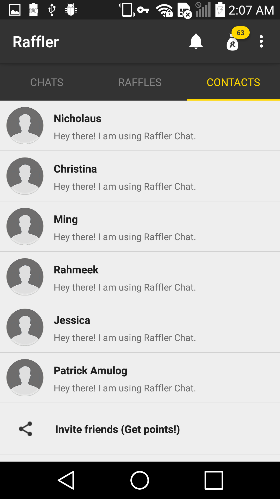
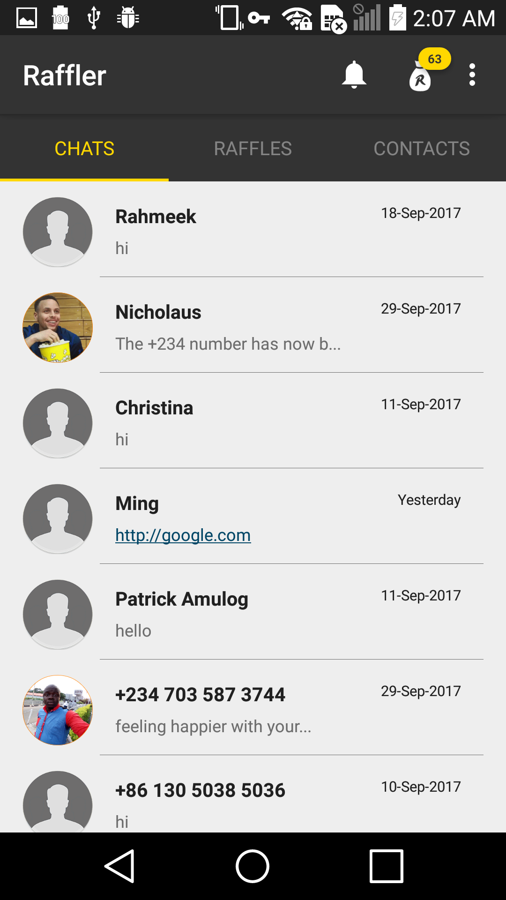

# Raffler-Android
Whatsapp style texting app

## Screenshots

## Current Version

Download on Google Play:

## History

## Contribute

There is always room for improvement.

#### Report issue

Did you encounter bugs? Report them [here](https://github.com/AppHero2/Raffler-Android/issues). The more relevant information you provide the easier and faster it can be resolved.

#### Contribute

As mentioned, there is always room for improvement. Do you have any performance improvement ideas? Please suggest them [here](https://github.com/AppHero2/Raffler-Android/issues). Before submitting a large Pull Request, creating an issue to discuss your ideas would be the preferred way so we can be sure it is in line with other improvements currently being developed. Is it a simple improvement? Go ahead and submit a Pull Request! I very welcome any contributions.

## License

Raffler is released under the Raffler LLC license. See [LICENSE](https://github.com/AppHero2/Raffler-Android/LICENSE) for details.

